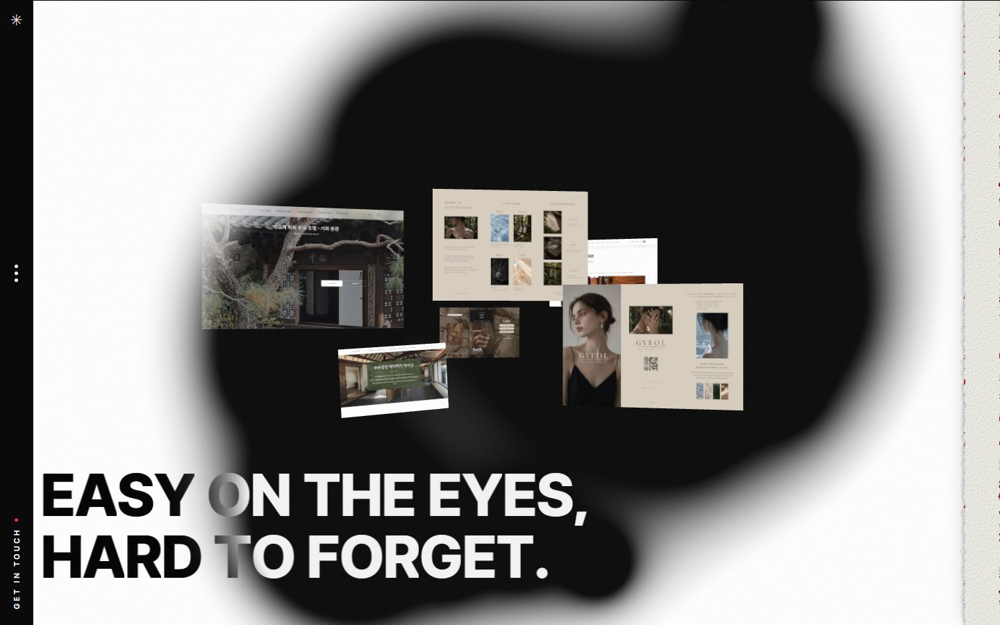
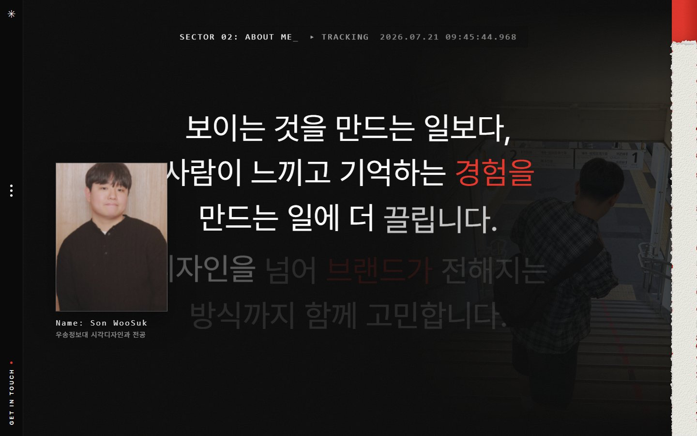
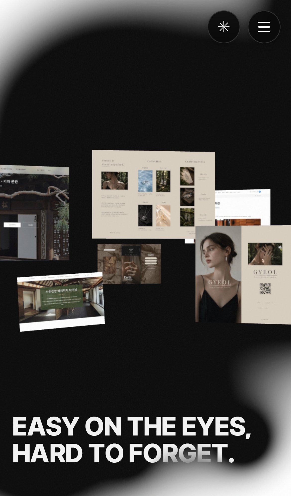

# 🗂️ SON WOOSUK — Portfolio One Page

> "Easy on the eyes, hard to forget." — 스크롤 인터랙션으로 작업물을 보여주는 개인 포트폴리오

[](https://new-chat-ruby-six.vercel.app)
[](https://react.dev)
[](https://vite.dev)
[](https://gsap.com)
[](https://threejs.org)

---

## 📌 프로젝트 소개

**React + Vite**로 제작한 개인 포트폴리오 원페이지입니다.
자기소개부터 스킬, 작업 방식, 실제 작업물까지 스크롤 하나로 이어지는 흐름으로 구성했습니다. 각 섹션마다 다른 애니메이션과 인터랙션을 적용했고, 작업물을 클릭하면 상세 페이지로 이동해 실제 작업 내용과 라이브 사이트를 함께 볼 수 있습니다.

**→ [new-chat-ruby-six.vercel.app](https://new-chat-ruby-six.vercel.app)**

---

## 🖼️ 미리보기

| Hero | About Me |
|:---:|:---:|
|  |  |

**Mobile**



---

## ⚠️ 주의사항

- 마우스 커서 효과 등 일부 인터랙션은 PC 전용입니다. 모바일에서는 자동으로 제외되거나 탭 방식으로 대체됩니다.
- 포트폴리오 표 섹션은 PC에서 물체가 떨어지는 물리 애니메이션이 있어 처음 로딩 시 다소 무거울 수 있습니다. 모바일에서는 이 효과 없이 표를 바로 보여줍니다.
- 각 작업물의 소개 내용은 실제 프로젝트를 기반으로 직접 작성했습니다.

---

## 📋 프로젝트 정보

| 항목 | 내용 |
|:---:|:---|
| 담당 역할 | 기획 / 디자인 / 퍼블리싱 / 인터랙션 구현 |
| 작업 기간 | 2026.07.13 ~ 2026.07.15 (3일) |
| 기여도 | 100% (개인 프로젝트) |

---

## 🛠️ 기술 스택

**Frontend**


**빌드 / 배포**


| 기술 | 용도 |
|:---|:---|
| GSAP | 스크롤 연동 애니메이션, 섹션 고정 효과 전반 |
| React Three Fiber | 3D 갤러리 장면 구현 |
| Matter.js | 포트폴리오 표 — 물체가 떨어졌다가 제자리로 모이는 효과 |
| React Router | 원페이지 ↔ 작품 상세 페이지 이동 처리 |

---

## 🤖 AI 활용

### 사용한 AI 도구

- Claude Code (Anthropic)

### AI 활용 내용

- [x] 모바일 반응형 레이아웃 전면 적용 (PC/모바일 애니메이션 분리)
- [x] 터치 기기에서 첫 번째 탭은 미리보기, 두 번째 탭은 이동하는 방식 구현
- [x] 모바일에서 사용할 수 없는 커서 효과 섹션 자동 제외
- [x] 작품 상세 페이지 모바일 레이아웃 수정 및 프로젝트 설명 정리

### 직접 구현한 내용

- [ ] 전체 사이트 콘셉트·섹션 구성 기획
- [ ] 실제 작업물 6종 기획·디자인·퍼블리싱 (락고재, GYEOL, 랜딩페이지, 소셜 콘텐츠, 충남관광재단 클론, 여행 랜딩)
- [ ] 사진·영상 등 콘텐츠 직접 확보

---

## 🔗 프로젝트 링크

| 구분 | 링크 |
|:---|:---|
| 배포 사이트 | [new-chat-ruby-six.vercel.app](https://new-chat-ruby-six.vercel.app) |
| GitHub | [github.com/Sonwoosuk/portfolio](https://github.com/Sonwoosuk/portfolio) |

---

## 📖 프로젝트 개요

보여주기식 갤러리가 아니라, 스크롤을 따라가는 동안 "누가 무엇을 어떻게 만들었는지"가 자연스럽게 읽히는 포트폴리오를 목표로 했습니다.

- **목표**: 자기소개 · 스킬 · 작업 프로세스 · 실제 작업물을 하나의 스크롤 흐름으로 연결
- **타겟**: 채용 담당자, 협업 파트너 등 포트폴리오를 처음 보는 사람
- **핵심 가치**: 절제된 톤 · 스크롤 인터랙션 · 실제 작업물 근거

---

## ✨ 주요 기능

섹션은 아래 순서로 이어집니다.

| 섹션 | 설명 |
|:---|:---|
| 인트로 | 로딩 후 이미지 콜라주와 태그라인 등장 |
| 브랜드 마퀴 | 텍스트가 가로로 흘러가는 효과 |
| About Me | 스크롤하면 자기소개 문장이 단어 단위로 나타나는 효과 |
| Manifesto | 텍스트가 깨지는 듯한 글리치 효과 |
| Skills | 스킬 목록이 돌아가며 나열되는 효과 |
| AI Capability | AI 도구 활용 역량 소개 |
| Process | 작업 프로세스 안내 |
| Services | 제공 서비스 소개 |
| 가로 스크롤 작업물 | 작업물을 옆으로 넘기며 볼 수 있는 프리뷰 |
| 3D 갤러리 | 3D 공간에 작업물 이미지가 배열되는 섹션 |
| 포트폴리오 표 | 작업물 제목이 흩어졌다 표로 조립됨, 클릭 시 상세 페이지 이동 |
| Playground | 커서를 움직이면 이미지가 따라오는 효과 (PC 전용) |
| Epilogue | 마무리 · 연락처 |
| 작품 상세 페이지 | 각 작업물 상세 설명, 라이브 사이트 링크 |

---

## 🔧 핵심 구현 내용

**1. 스크롤 애니메이션**

- GSAP을 사용해 스크롤 위치에 따라 각 섹션이 고정되거나 움직이는 애니메이션을 구현했습니다.
- 스크롤러가 완전히 준비된 뒤 섹션을 화면에 그려야 애니메이션이 정상 동작해서, 초기화 순서를 맞추는 처리를 했습니다.

**2. 포트폴리오 표 물리 낙하 효과**

- 포트폴리오 표 섹션에서 프로젝트 제목들이 화면 위로 흩어졌다가 스크롤에 맞춰 제자리로 조립되는 연출을 구현했습니다.
- Matter.js로 물리 시뮬레이션을 실행하고, 완성 시점에 GSAP으로 원위치로 부드럽게 복귀시켰습니다.
- 모바일에서는 이 효과 없이 완성된 표를 바로 보여줘 성능 문제를 방지했습니다.

**3. 작품 상세 → 목록 복귀 시 위치 복원**

- 작품 상세 페이지에서 "목록으로" 돌아올 때, 포트폴리오 표가 이미 완성된 시점으로 자동 이동해 물리 낙하 효과를 처음부터 다시 보지 않도록 처리했습니다.

**4. 모바일 대응**

- 모바일과 PC를 감지해 hover 효과를 터치에 맞게 바꿨습니다.
- 포트폴리오 표, 가로 스크롤 작업물 등에서 첫 번째 탭은 미리보기, 두 번째 탭은 페이지 이동으로 동작합니다.
- 커서가 있어야 동작하는 Playground 섹션은 모바일에서 아예 표시하지 않습니다.

---

## 🚧 문제 해결

| 문제 | 원인 | 해결 |
|:---|:---|:---|
| 모바일에서 hover 효과가 동작하지 않음 | 터치 기기엔 마우스 hover가 없음 | 터치 기기를 감지해 첫 탭은 미리보기, 두 번째 탭은 이동으로 대체 |
| Playground 섹션이 모바일에서 빈 화면으로 표시 | 커서를 움직여야 동작하는 효과라 터치로는 재현 불가 | 모바일에서 해당 섹션 자체를 표시하지 않음 |
| AI Capability 섹션 모바일에서 일부 요소가 텍스트를 가림 | PC 레이아웃을 모바일에 그대로 적용 | 모바일 전용 레이아웃으로 재배치 |
| Services 섹션 모바일에서 텍스트가 과하게 길어짐 | PC 비율 그대로 상속 | 모바일 전용 CSS로 레이아웃 재조정 |
| 작품 상세 페이지 상단 정보가 모바일에서 잘림 | PC용 텍스트 길이를 그대로 사용 | 모바일에서 한 줄로 축소, 세로 배치로 변경 |

---

## 📁 프로젝트 구조

```
portfolio/
├── src/
│   ├── pages/
│   │   ├── Landing.jsx        # 원페이지 전체 구성
│   │   └── WorkDetail.jsx     # 작품 상세 페이지
│   ├── components/            # 섹션별 컴포넌트 (각 CSS 파일 동반)
│   ├── data/works.js          # 작품별 상세 데이터
│   └── App.jsx                # 페이지 라우팅
│
├── public/                    # 이미지·폰트 등 정적 파일
├── vercel.json                # 배포 설정
└── vite.config.js
```

---

## 🚀 실행 방법

```bash
# 1. 레포지토리 클론
git clone https://github.com/Sonwoosuk/portfolio.git

# 2. 의존성 설치
cd portfolio
npm install

# 3. 개발 서버 실행
npm run dev
```

---

## 📝 개선 예정

- [ ] 구글 검색·SNS 공유 시 보이는 제목·이미지(메타태그) 추가
- [ ] 애니메이션 줄이기 설정을 켠 사용자 대응
- [ ] 이미지 최적화 (화면에 보일 때만 불러오기)

---

## 🪞 프로젝트 회고

**잘된 점**
- 물리 낙하 효과와 조립 애니메이션을 조합해 포트폴리오 표에 독특한 인터랙션을 구현할 수 있었음
- PC/모바일 분기 처리를 깔끔하게 분리해 두 환경 모두 자연스러운 경험 제공

**아쉬운 점**
- 처음부터 모바일을 고려하지 않고 PC 기준으로만 개발해, 나중에 모바일 대응 작업이 한꺼번에 몰림
- 검색 노출을 위한 메타태그를 처음부터 챙기지 못함

**다음에 시도할 것**
- 모바일 먼저 설계하고 PC로 확장하는 방식으로 시작
- 이미지 최적화(화면에 들어올 때만 불러오기)로 초기 로드 속도 개선

---

## 📄 License

This project is for portfolio purposes only.
